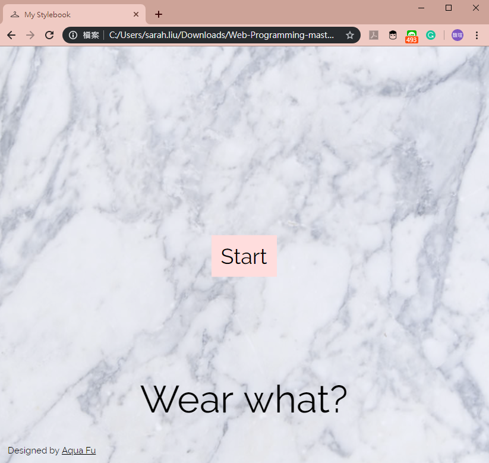
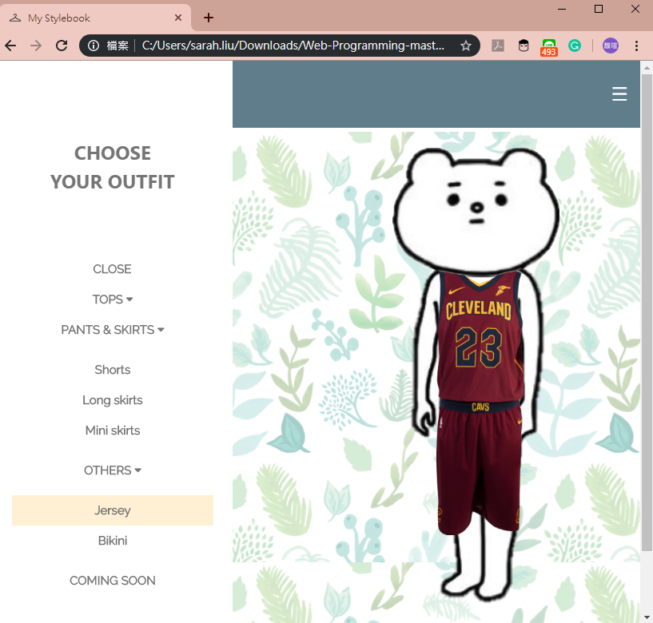

# Stylebook
### 2018 March, Class Web Programming assignments HW1

It's a closet/fashion stylebook enables users to choose and preview what to wear.

* Part of CSS Based on W3 template.
* Clothes pictures from the Internet, all rights reserved.

## Usage
* Simply open .html file and use it on your browser.
* start-page -> main page.
* choose your outfit with menu bar on the left side

## A quick glance at My StyleBook

